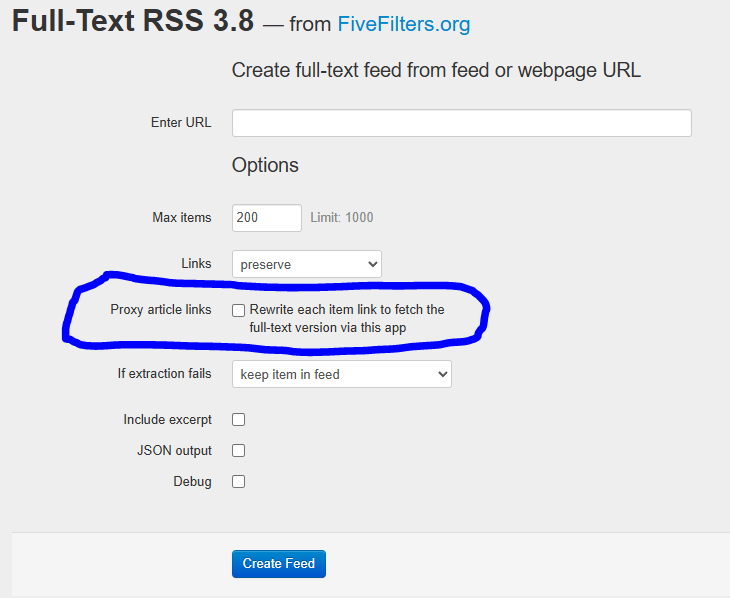

# Fivefilters Full Text RSS

Home to a docker image built on top of https://github.com/heussd/fivefilters-full-text-rss-docker with an additional feature to allow users to create feeds that are proxied back through Full-Text RSS itself.

This is done via both a checkbox in the UI and a query parameter (`?proxy=1`) that can be added to the feed URL.

# Docker

Available via [docker hub](https://hub.docker.com/r/csm10495/fivefilters-full-text-rss): `docker pull csm10495/fivefilters-full-text-rss:latest`.

## License Info

[Full-Text RSS](https://bitbucket.org/fivefilters/full-text-rss) is licensed under the AGPL License. Therefore this repository is also licensed under the AGPL License. See [LICENSE](LICENSE.md) for more details.

